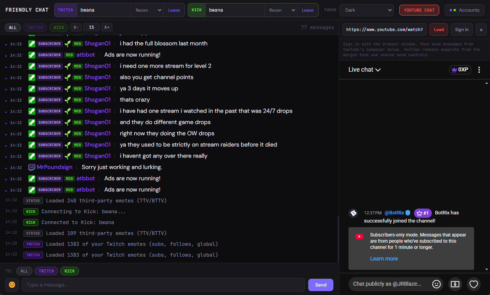

# Friendly Chat

A desktop app that merges live chat from Twitch and Kick into one unified window, with an optional embedded YouTube Live Chat panel. Built with Electron.


## What it does

Friendly Chat lets you watch and participate in Twitch and Kick chats in one place.

- View Twitch + Kick chats in a single feed
- Open YouTube Live Chat from a livestream URL without configuring a YouTube API or OAuth client
- Sign in through the app's browser session and send messages from YouTube's own chat composer
- Filter by platform
- Send messages to one or both platforms at once
- Load recent chat history when you join a channel
- Emote support including BTTV, 7TV, and native platform emotes
- Tab autocomplete for emotes (`:emote`) and mentions (`@username`)
- Click a username to reply, timeout, ban, or delete messages
- Adjustable font size that saves between sessions
- Light, dark, and match-system theme modes



## Download

Grab the latest installer for your platform from the [Releases](../../releases) page.

### Mac Installation Note

If you see **"Friendly Chat is damaged and can't be opened"** when launching on Mac, this is due to Apple's Gatekeeper blocking unsigned apps. To fix it, open **Terminal** and run:

```
xattr -cr /Applications/Friendly\ Chat.app
```

Then try opening the app again. Alternatively go to **System Settings → Privacy & Security** and click **Open Anyway** if the option appears there.

## Getting started

1. Launch Friendly Chat
2. Click **Accounts** and connect Twitch and/or Kick
3. Type a channel name and click **Join**
4. To use YouTube chat, click **YouTube Chat**, paste a livestream URL, and click **Load**
5. Click **Sign in** in the YouTube panel, complete browser sign-in, and close that window
6. Send YouTube messages from the composer inside the YouTube panel

You can watch and read chats without signing in. Signing in is only required to send messages.

YouTube chat uses YouTube's official website embed and follows Friendly Chat's light, dark, or system theme. Browser sign-in and the embedded chat share the same persistent Electron session, so no YouTube API key or OAuth client is needed. It remains in a separate panel because browsers do not allow Friendly Chat to read or merge the contents of YouTube's cross-origin iframe. Use YouTube's composer in that panel to send messages; the shared message box and Friendly Chat moderation tools remain unavailable for YouTube.

## Built with

- [Electron](https://www.electronjs.org)
- [Twitch IRC](https://dev.twitch.tv/docs/irc/)
- [Kick Pusher WebSocket](https://kick.com)
- [YouTube embedded Live Chat](https://support.google.com/youtube/answer/2524549)
- [BTTV](https://betterttv.com) / [7TV](https://7tv.app) emotes
- [recent-messages.robotty.de](https://recent-messages.robotty.de) for Twitch chat history
