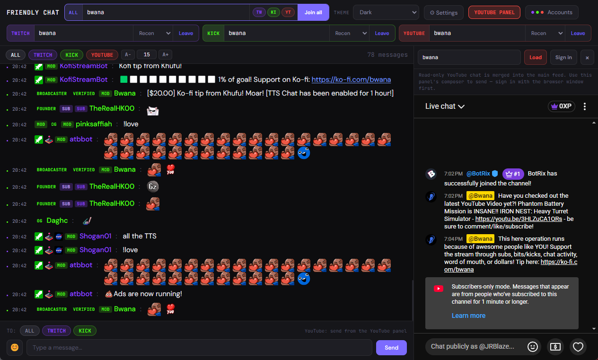

# Friendly Chat

A desktop app that merges live chat from Twitch, Kick and YouTube into one unified window. Built with Electron.


## What it does

Friendly Chat lets you watch and participate in Twitch, Kick and YouTube chats in one place.

- View Twitch, Kick and YouTube chat in a single merged feed
- Join the same channel name on every platform at once with **Join all**
- Open a YouTube live chat from a channel name or `@handle` — no need to hunt down the livestream URL
- Filter the feed by platform
- Send messages to Twitch and Kick at once (YouTube sends from its own panel)
- Load recent chat history when you join a channel, with the original timestamps
- Reopen recently joined channels from a local recent-chat list
- Emotes from every source each platform supports: Twitch global/channel/sub/follower emotes, Kick global, emoji and channel emotes, YouTube emoji and channel member emotes, plus 7TV, BTTV and FrankerFaceZ
- Sound and/or desktop notification when your name is mentioned, each toggled separately
- Tab autocomplete for emotes (`:emote`) and mentions (`@username`), plus a searchable emote picker
- Click a username to reply, timeout, ban, or delete messages
- Adjustable font size that saves between sessions
- Light, dark, and match-system theme modes



## Download

Grab the latest installer for your platform from the [Releases](../../releases) page.

### Mac Installation Note

If you see **"Friendly Chat is damaged and can't be opened"** when launching on Mac, this is due to Apple's Gatekeeper blocking unsigned apps. To fix it, open **Terminal** and run:

```
xattr -cr /Applications/Friendly\ Chat.app
```

Then try opening the app again. Alternatively go to **System Settings → Privacy & Security** and click **Open Anyway** if the option appears there.

## Getting started

1. Launch Friendly Chat
2. Click **Accounts** and connect Twitch and/or Kick
3. Type a channel name and click **Join**, or use the **ALL** box and **Join all** to open the same name on every platform at once
4. For YouTube, type the channel name, its `@handle`, or a livestream URL — Friendly Chat finds whatever that channel is streaming right now

You can watch and read chats without signing in. Signing in is only required to send messages.

## Mention alerts

Open **Settings** to choose what happens when someone says your name:

- **Play a sound** — a short chime generated in the app, with a volume slider. No sound file to install.
- **Show a desktop notification** — uses your operating system's notification centre.

The two toggles are independent, so you can have sound only, notification only, both, or neither. Your connected Twitch and Kick account names are always highlighted; add any other names you go by in **Extra names to highlight**.

Alerts are rate limited to one every 1.2 seconds, and channel history replayed on join never triggers them.

## Performance

**Settings → Performance** controls how many messages the feed keeps (200–5000, default 500). Older messages are dropped so a stream you leave open all day stays responsive. You can also turn off the message fade-in animation for the smoothest scrolling on very busy channels.

## How YouTube works

YouTube has no public chat API that works from a channel name alone, and a browser cannot read youtube.com directly because of cross-origin rules. Friendly Chat's local server does the work instead:

1. It loads the channel's `/live` page to find the video that is streaming now.
2. It reads the live chat page once for YouTube's own continuation token.
3. It long-polls YouTube's live chat endpoint and hands normalized messages back to the app.

No API key, OAuth client or third-party service is involved. Messages, author badges, Super Chats, memberships and custom channel emoji all render in the merged feed.

The panel on the right still embeds YouTube's own chat widget. That is what you use to *send* YouTube messages: click **Sign in**, complete browser sign-in, and use the composer inside the panel. The shared message box remains Twitch and Kick only, because sending to YouTube would require a Google OAuth client.

If YouTube changes its payloads or the stream ends, the merged feed says so and the panel keeps working on its own.

## Development

```
npm install
npm start      # run the app
npm test       # run the full offline test suite
```

The test suite loads the real `friendly-chat.html` into jsdom with the network stubbed, then drives the app the way a user would: joining channels on all three platforms, rendering emotes from every source, filtering, sending, moderating, autocompleting, changing settings, and pushing thousands of messages through the feed to check it stays bounded. The server and YouTube parsers are covered separately. Nothing in the suite touches the network.

Run one suite with `node tests/run.js <name>` (`youtube`, `server`, `render`, `app`, `perf`).

## Built with

- [Electron](https://www.electronjs.org)
- [Twitch IRC](https://dev.twitch.tv/docs/irc/)
- [Kick Pusher WebSocket](https://kick.com)
- YouTube live chat (the same endpoint youtube.com's own chat page uses)
- [BTTV](https://betterttv.com) / [7TV](https://7tv.app) / [FrankerFaceZ](https://www.frankerfacez.com) emotes
- [recent-messages.robotty.de](https://recent-messages.robotty.de) for Twitch chat history
